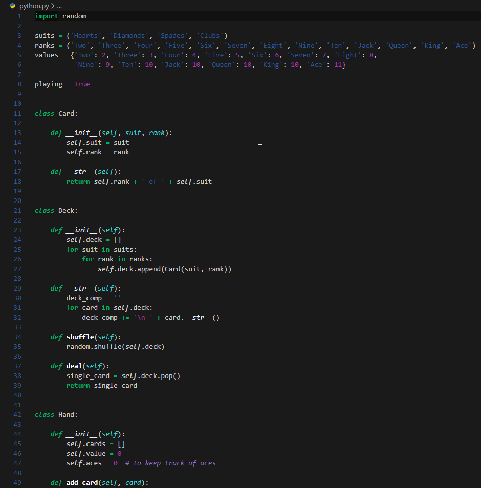
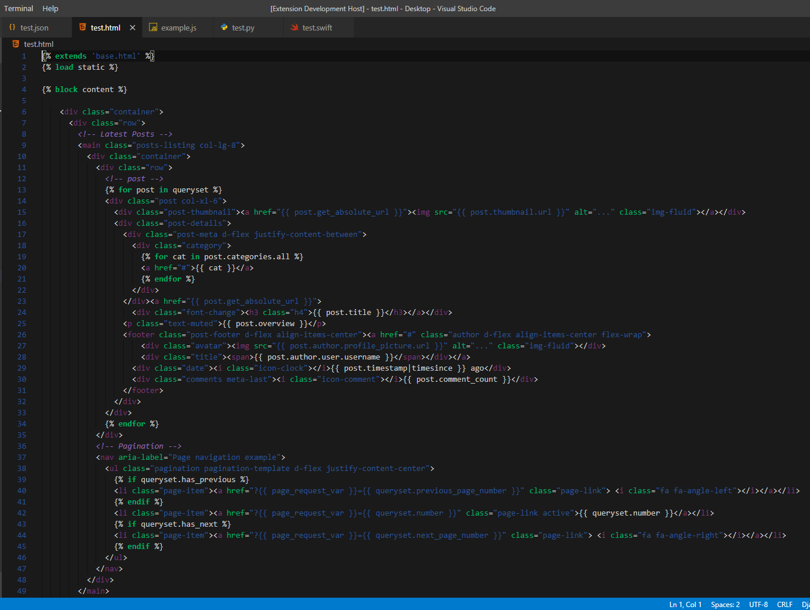
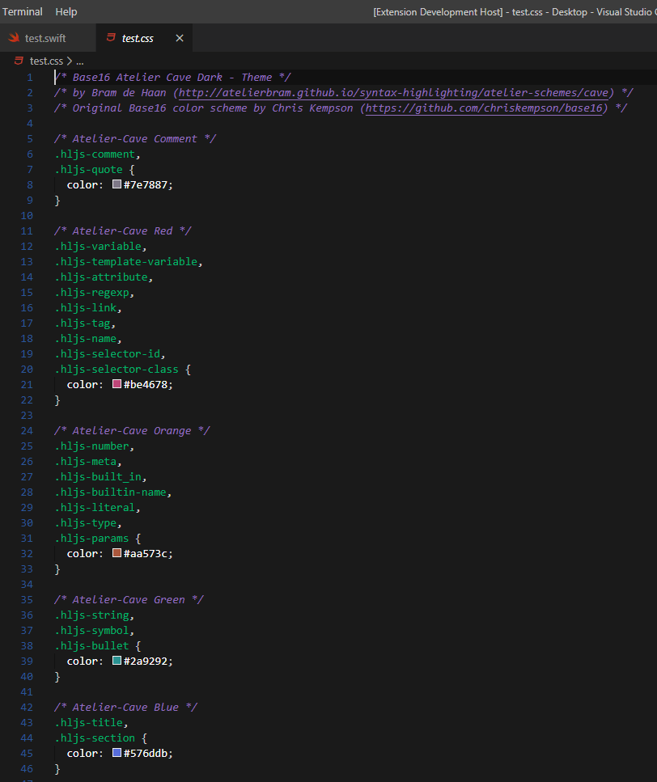
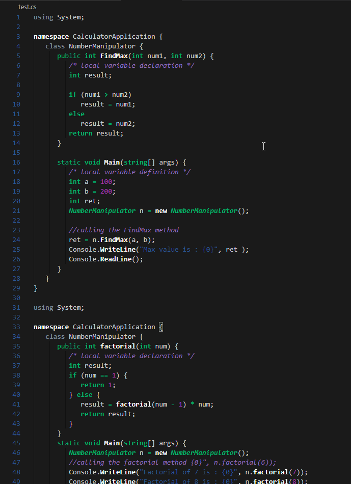
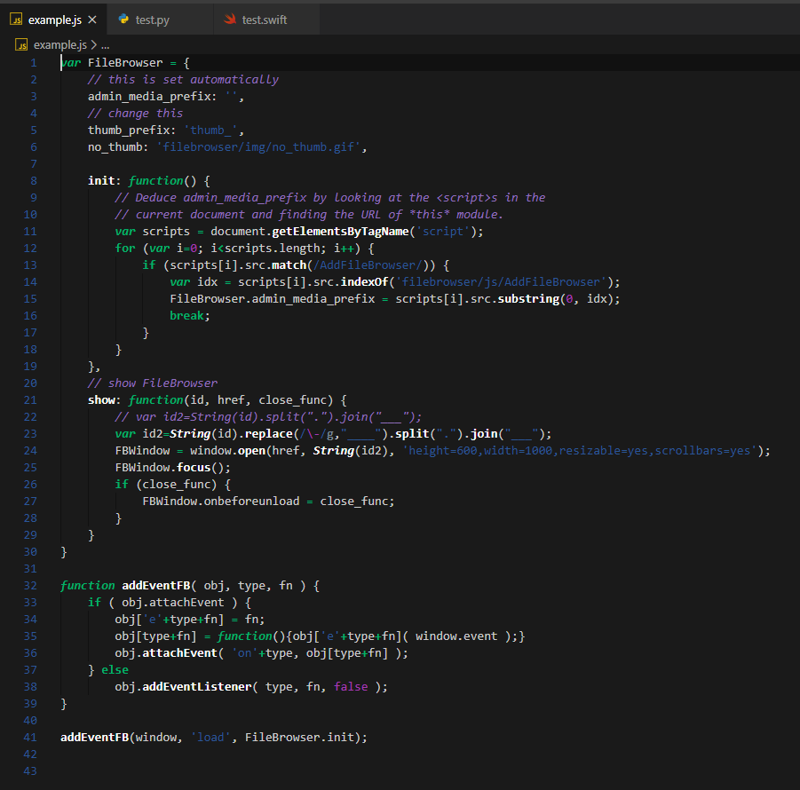
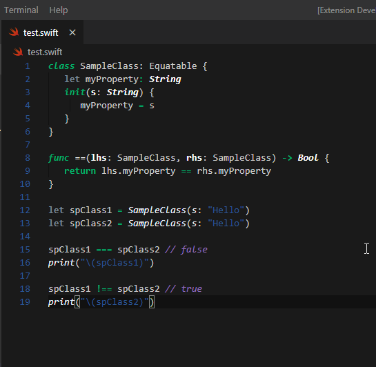

# README
## Inquisitively's Dark Theme
This is the first theme I've ever created. I wanted to start coding all my personal projects in 
the same theme that I use in the code snippet plug in on [Inquisitively](https://www.inquisitively.io)

This was as close as I could get to the theme on the site, I think it's really close. But you may see some differences.

I hope that you enjoy it!

Languages I use and checked the theme for:

----------
1. Python
----------

----------
2. HTML
----------

----------
3. CSS
----------

----------
4. C#
----------

Other Examples In Languages I do not Program in:

----------
1.JavaScript
----------

----------
2.Swift
----------

You're welcome to use the theme and let me know how it looks for other languages. 

### For more information
* [Visit Inquisitively](https://www.inquisitively.io)

**Enjoy! And Share!**
